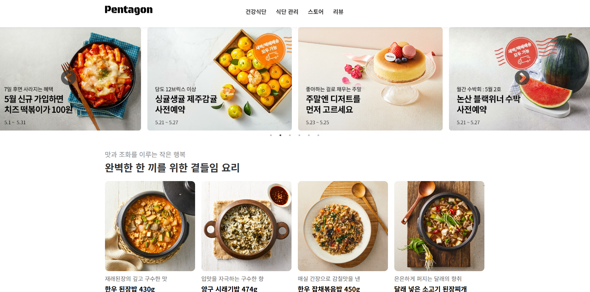

# HealthyPentagon

건강한 식단 추천, 신뢰할 수 있는 식재료, 사용자 리뷰를 제공하는 **웹 기반 식품 정보 플랫폼**입니다.  
백엔드는 **JSP (Java Server Pages)**, **MySQL**, **Apache Tomcat 9**을 사용하고, 프런트엔드는 **HTML5/CSS3/JavaScript**로 구성되어 있습니다.

> 이 문서는 Tomcat과 MySQL을 이용한 **로컬 개발 환경** 설정 방법과 샘플 DB 스키마를 포함합니다.

---

## 🖼 미리보기

아래는 ** 건강 식단 및 제품 리뷰 ** 웹 애플리케이션의 미리보기 화면입니다.



---

## 🔎 주요 기능

- **건강 식단** (`diet_management.jsp`): 단백질/저칼로리/저당 탭, MySQL에서 동적 로딩
- **제품 리뷰** (`review.jsp`): 이미지/리뷰 수가 포함된 카드형 목록
- **외부 쇼핑몰 배너** (`store.jsp`): 마켓컬리·쿠팡 등 외부 링크
- **메인 페이지** (`main.jsp`): 배너 및 하이라이트

---

## 🧱 기술 스택

- **Frontend**: HTML5, CSS3, JavaScript (ES6+)
- **Backend**: JSP (Java Server Pages)
- **Database**: MySQL
- **Server**: Apache Tomcat 9.x

---

## 📂 디렉토리 구조 (주요 경로)

```
src/main/webapp/
├─ css/
│  ├─ style.css
│  └─ item.css
├─ images/
│  ├─ sides/  desserts/  review/  ... 
├─ views/
│  ├─ banner.jsp
│  ├─ diet_management.jsp
│  ├─ footer.jsp
│  ├─ header.jsp
│  ├─ healthy_diet.jsp
│  ├─ main.jsp
│  └─ review.jsp
├─ dbconn.jsp
└─ index.jsp
```

---

## 🗄️ DB 스키마 (샘플)

### 테이블: `healthy_diets`
| 필드        | 타입         | 설명                         |
|-------------|--------------|------------------------------|
| `id`        | INT PK       | Auto-increment               |
| `category`  | VARCHAR(20)  | 'protein' / 'calorie' / 'low_sugar' |
| `name`      | VARCHAR(255) | 식품명                        |
| `kcal`      | INT          | 칼로리                        |
| `image_url` | VARCHAR(255) | 이미지 링크                   |

```sql
CREATE TABLE healthy_diets (
  id INT AUTO_INCREMENT PRIMARY KEY,
  category VARCHAR(20) NOT NULL,
  name VARCHAR(255) NOT NULL,
  kcal INT,
  image_url VARCHAR(255)
);
```

### 테이블: `reviews`
| 필드           | 타입          | 설명             |
|----------------|---------------|------------------|
| `id`           | INT PK        | Auto-increment   |
| `title`        | VARCHAR(255)  | 제품명            |
| `content`      | TEXT          | 리뷰 내용         |
| `review_count` | INT           | 리뷰 수           |
| `image_url`    | VARCHAR(255)  | 이미지 링크       |

```sql
CREATE TABLE reviews (
  id INT AUTO_INCREMENT PRIMARY KEY,
  title VARCHAR(255) NOT NULL,
  content TEXT,
  review_count INT DEFAULT 0,
  image_url VARCHAR(255)
);
```

> 개발용으로 각 테이블에 몇 개의 더미 데이터를 넣어두면 편리합니다.

---

## 🧪 로컬 실행

### 1) 사전 준비
- **JDK 17** (또는 Tomcat과 호환되는 11+)
- **Apache Tomcat 9.x**
- **MySQL 8.x** (또는 5.7+)

### 2) 데이터베이스
1. DB 생성 (예: `healthy_pentagon`)
2. 위 **CREATE TABLE** 실행
3. 샘플 데이터 삽입
4. `dbconn.jsp`에 접속 정보 업데이트:
   ```jsp
   <%
     String url = "jdbc:mysql://localhost:3306/healthy_pentagon?serverTimezone=UTC&useSSL=false&characterEncoding=utf8";
     String user = "root";
     String password = "1234";
     Class.forName("com.mysql.cj.jdbc.Driver");
     Connection conn = DriverManager.getConnection(url, user, password);
   %>
   ```

### 3) Tomcat으로 실행
- IDE(Eclipse/IntelliJ)에서 Java Web 프로젝트로 Import
- **Tomcat 9** 서버 설정
- 아티팩트/배포 설정 후 실행

### 4) 접속 경로
- `http://localhost:8080/<context-path>/views/main.jsp`
  - 또는 `http://localhost:8080/<context-path>/index.jsp`

---

## 🧭 로드맵
- [ ] 리뷰 검색/필터 추가
- [ ] 식단/리뷰 **관리자 CRUD** 추가
- [ ] DB 접근 로직을 **DAO**로 분리 및 커넥션 풀 적용
- [ ] UI 다국어(i18n, KR/EN)
- [ ] DAO 레이어 단위 테스트

---

## 🤝 기여
PR 환영합니다. 변경 전 이슈에 제안해 주세요.

---

## 📄 라이선스
MIT — [LICENSE](./LICENSE) 참고.

---

## 🌍 다른 언어
- [🇬🇧 English README](./README.en.md)
---

**© 2025 Healthy Food Web — JSP 기반 식품 정보 플랫폼**
